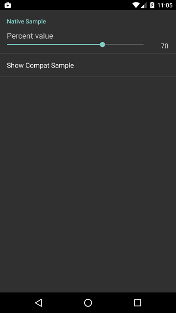
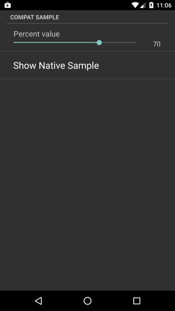

# seekbar-preference
A SeekBarPreference that stores its value in a percentual relation (0 to 1) on max and min values

## Import
On your `build.gradle` add:
```
    repositories {
        maven { url 'https://dl.bintray.com/gmazzo/maven' }
    }

    dependencies {
        compile 'com.github.gmazzo:seekbar-preference:0.1'
    }
```

## Usage with native `android.preference.Preference`
In your `preferences.xml` add:
```xml
    <gs.preference.PercentSeekBarPreference
        android:key="someKey"
        android:title="Percent value"
        android:defaultValue="0.7"/>
```

## Usage with compat `android.support.v7.preference.Preference`
In your `preferences.xml` add:
```xml
    <gs.preference.PercentSeekBarPreferenceCompat
        android:key="someKey"
        android:title="Percent value"
        android:defaultValue="0.7"/>
```

## Screenshots


